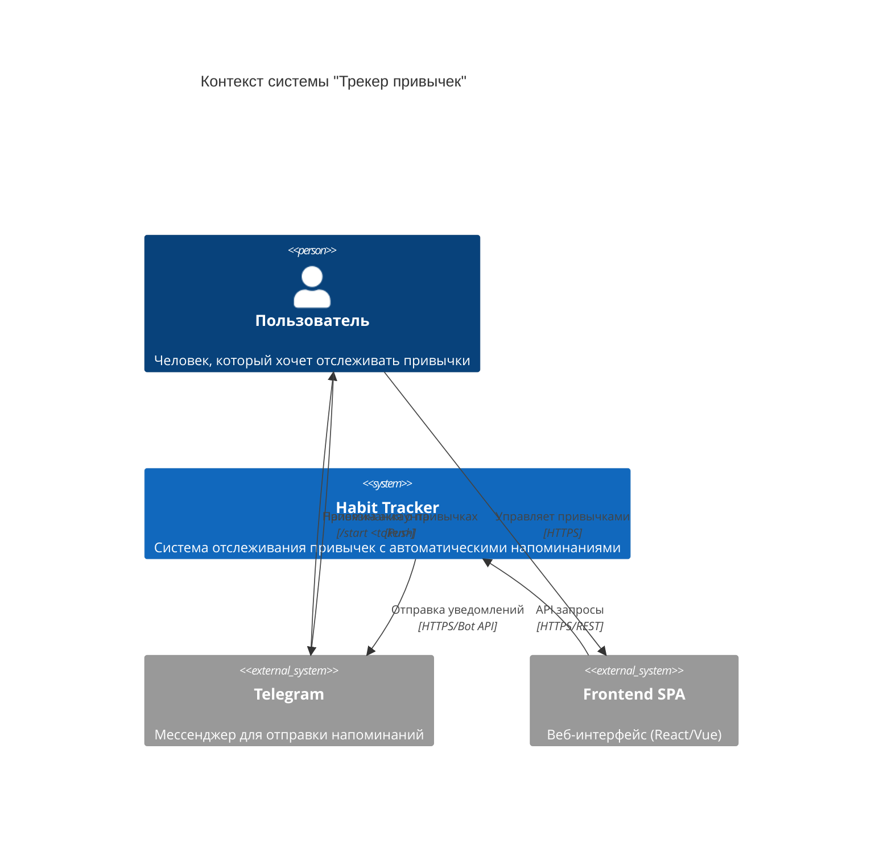
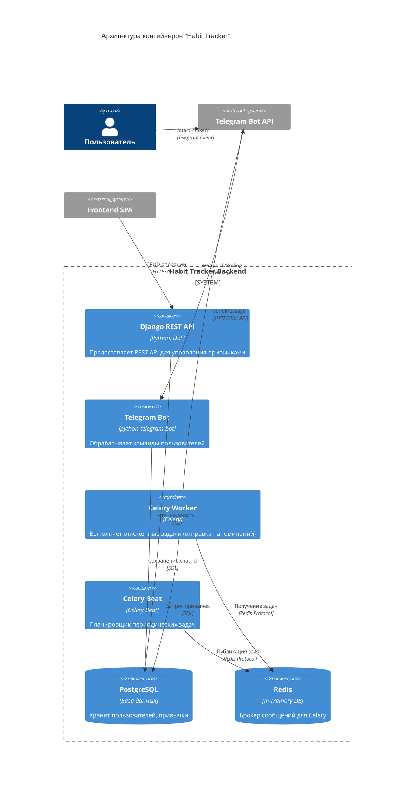
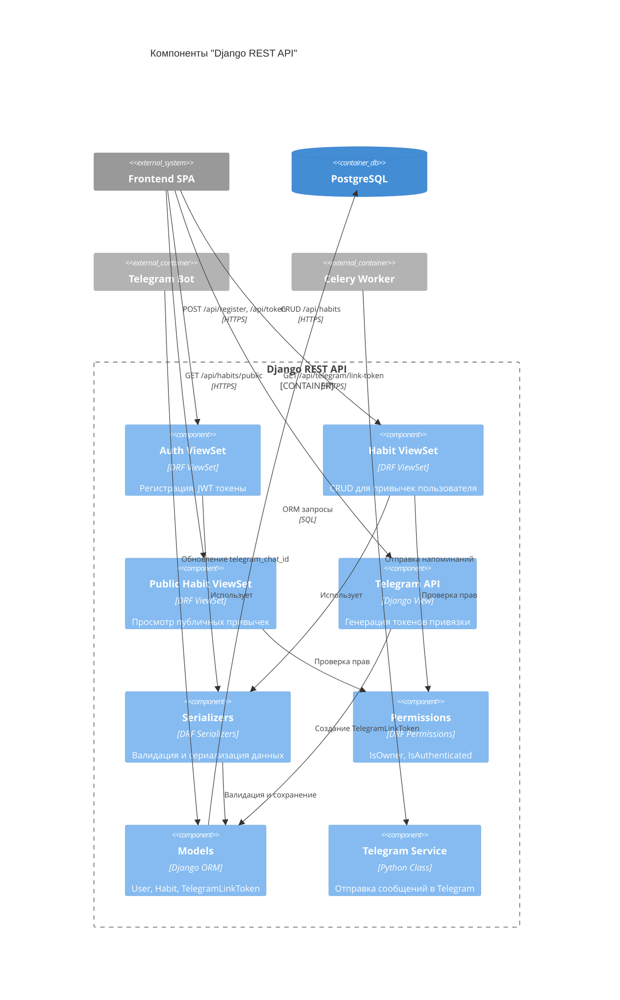

# План разработки: Трекер привычек (Habit Tracker)

## 📑 Оглавление

- [Обзор проекта](#-обзор-проекта)
- [Примеры использования](#-примеры-использования)
- [Структура приложений Django](#️-структура-приложений-django)
- [Детализация модулей](#-детализация-модулей)
- [Telegram: Webhook vs Polling](#-telegram-webhook-vs-polling)
- [Эндпоинты API](#-эндпоинты-api)
- [Схема базы данных (DBML)](#️-схема-базы-данных-dbml)
- [C4 Диаграммы архитектуры](#-c4-диаграммы-архитектуры)
- [Потоки данных](#-потоки-данных)
- [Конфигурация (Settings)](#️-конфигурация-settings)
- [План реализации](#-план-реализации-последовательность)
- [Открытые вопросы](#-открытые-вопросы-для-уточнения)
- [Примечания](#-примечания)

---

## 📋 Обзор проекта

### Цель проекта
Разработать **backend-часть SPA веб-приложения** для отслеживания полезных привычек с автоматическими напоминаниями через Telegram.

Проект основан на идеях из книги Джеймса Клира "Атомные привычки" (2018), где хорошая привычка описывается формулой:

```
Я буду [ДЕЙСТВИЕ] в [ВРЕМЯ] в [МЕСТО]
```

### Ключевые возможности

1. **Управление привычками** - создание, редактирование, удаление через REST API
2. **Типы привычек** - полезные (основные) и приятные (вознаграждения)
3. **Автоматические напоминания** - отправка уведомлений в Telegram по расписанию
4. **Публичные привычки** - возможность видеть чужие привычки для вдохновения
5. **Валидация правил** - автоматическая проверка бизнес-логики из книги

[↑ К оглавлению](#-оглавление)

---

## 🎯 Примеры использования

### Пример 1: Полезная привычка с приятной привычкой (связанной)

**Пользователь создаёт через веб-интерфейс:**

```json
// Приятная привычка (создаётся первой)
POST /api/habits
{
  "action": "Принять горячую ванну",
  "is_pleasant": true,
  "duration": 20,
  "place": "Ванная комната",
  "time": "07:30"
}
// → ID = 5

// Полезная привычка (ссылается на приятную)
POST /api/habits
{
  "action": "Пробежать 3 км",
  "place": "Городской парк",
  "time": "07:00",
  "periodicity": 1,
  "duration": 30,
  "is_pleasant": false,
  "related_habit": 5,
  "is_public": true
}
```

**Результат:**
- Каждый день в 07:00 пользователь получает в Telegram:
```
⏰ Напоминание!

Я буду пробежать 3 км в 07:00 в городской парк
После выполнения: принять горячую ванну
```

### Пример 2: Полезная привычка с текстовым вознаграждением

```json
POST /api/habits
{
  "action": "Прочитать 20 страниц книги",
  "place": "Диван в гостиной",
  "time": "21:00",
  "periodicity": 1,
  "duration": 30,
  "is_pleasant": false,
  "reward": "Выпить чашку горячего шоколада",
  "is_public": false
}
```

**Результат:**
- Каждый день в 21:00:
```
⏰ Напоминание!

Я буду прочитать 20 страниц книги в 21:00 в диван в гостиной
Вознаграждение: выпить чашку горячего шоколада
```

### Пример 3: Еженедельная привычка

```json
POST /api/habits
{
  "action": "Навестить родителей",
  "place": "Дом родителей",
  "time": "14:00",
  "periodicity": 7,
  "duration": 120,
  "is_pleasant": false,
  "reward": "Вкусный домашний обед",
  "is_public": false
}
```

**Результат:**
- Раз в неделю (каждые 7 дней) в 14:00 приходит напоминание

[↑ К оглавлению](#-оглавление)

---

## 🏗️ Структура приложений Django

```
tracker/                      # Корневая директория проекта
├── config/                   # Конфигурация Django проекта
│   ├── settings.py          # Основные настройки
│   ├── urls.py              # Главный роутинг
│   └── celery.py            # Настройка Celery
│
├── users/                    # Приложение управления пользователями
│   ├── models.py            # Модель пользователя
│   ├── serializers.py       # Сериализаторы для регистрации/авторизации
│   ├── views.py             # ViewSets для auth
│   └── urls.py              
│
├── habits/                   # Приложение привычек (CORE)
│   ├── models.py            # Модель Habit
│   ├── serializers.py       # Сериализаторы + валидаторы
│   ├── views.py             # HabitViewSet, PublicHabitViewSet
│   ├── permissions.py       # IsOwner permission
│   ├── validators.py        # Бизнес-валидаторы
│   ├── pagination.py        # Пагинация (5 items/page)
│   └── urls.py
│
├── telegram_integration/     # Приложение Telegram
│   ├── models.py            # TelegramLinkToken
│   ├── views.py             # Эндпоинт генерации токена
│   ├── services.py          # TelegramService (отправка сообщений)
│   ├── bot.py               # Обработчик команд бота (/start)
│   └── urls.py
│
├── tasks/                    # Celery задачи
│   ├── __init__.py
│   └── reminder_tasks.py    # Периодическая задача напоминаний
│
├── requirements.txt          # Зависимости
├── .env.example             # Пример переменных окружения
├── manage.py
└── Plan.md                  # Этот файл
```

[↑ К оглавлению](#-оглавление)

---

## 📦 Детализация модулей

### 1. Users App (Пользователи)

**Назначение:** Управление регистрацией, авторизацией и профилями пользователей.

**Модель User:**
```python
from django.contrib.auth.models import AbstractUser

class User(AbstractUser):
    """Расширенная модель пользователя с поддержкой Telegram"""
    telegram_chat_id = models.BigIntegerField(...)
    
    class Meta:
        pass
```

**Эндпоинты:**
- `POST /api/register` - регистрация нового пользователя
- `POST /api/token` - получение JWT токена
- `POST /api/token/refresh` - обновление токена

**Пример регистрации:**
```json
POST /api/register
{
  "email": "user@example.com",
  "password": "SecurePass123!",
  "first_name": "Иван",
  "last_name": "Петров"
}

Response 201:
{
  "id": 42,
  "email": "user@example.com",
  "first_name": "Иван",
  "last_name": "Петров"
}
```

### 2. Habits App (Привычки) - CORE

**Назначение:** Основная бизнес-логика - управление привычками и валидация правил.

**Модель Habit:**
```python
from django.db import models
from django.conf import settings

class Habit(models.Model):
    """Модель привычки"""
    
    # Владелец
    user = models.ForeignKey(...)
    
    # Основные поля
    action = models.CharField(...)
    place = models.CharField(...)
    time = models.TimeField(...)
    
    # Тип привычки
    is_pleasant = models.BooleanField(...)
    
    # Вознаграждение (взаимоисключающие поля)
    related_habit = models.ForeignKey('self', ...)
    reward = models.CharField(...)
    
    # Параметры выполнения
    periodicity = models.PositiveIntegerField(...)
    duration = models.PositiveIntegerField(...)
    
    # Публичность
    is_public = models.BooleanField(...)
    
    # Служебные поля
    last_reminded_at = models.DateTimeField(...)
    created_at = models.DateTimeField(auto_now_add=True)
    updated_at = models.DateTimeField(auto_now=True)
    
    class Meta:
        pass
```

**Валидаторы (в serializers.py):**

```python
from rest_framework import serializers

class HabitSerializer(serializers.ModelSerializer):
    
    def validate(self, data):
        """Комплексная валидация привычки"""
        
        # 1. Взаимоисключение: reward ИЛИ related_habit
        # 2. Время выполнения <= 120 секунд
        # 3. Периодичность 1-7 дней
        # 4. Связанная привычка должна быть приятной
        # 5. Приятная привычка не имеет вознаграждения/связи
        
        pass
```

**Permissions (permissions.py):**
```python
from rest_framework import permissions

class IsOwner(permissions.BasePermission):
    """Доступ только владельцу"""
    
    def has_object_permission(self, request, view, obj):
        pass
```

**ViewSets:**
```python
from rest_framework import viewsets
from rest_framework.permissions import IsAuthenticated

class HabitViewSet(viewsets.ModelViewSet):
    """CRUD для привычек пользователя"""
    serializer_class = HabitSerializer
    permission_classes = [IsAuthenticated, IsOwner]
    pagination_class = HabitPagination  # 5 items/page
    
    def get_queryset(self):
        pass
    
    def perform_create(self, serializer):
        pass


class PublicHabitViewSet(viewsets.ReadOnlyModelViewSet):
    """Просмотр публичных привычек"""
    serializer_class = HabitSerializer
    permission_classes = [IsAuthenticated]
    pagination_class = HabitPagination
    
    def get_queryset(self):
        pass
```

### 3. Telegram Integration App

**Назначение:** Интеграция с Telegram Bot API для привязки аккаунтов и отправки уведомлений.

**Модель:**
```python
class TelegramLinkToken(models.Model):
    """Временные токены для привязки Telegram"""
    user = models.ForeignKey(...)
    token = models.CharField(...)
    created_at = models.DateTimeField(...)
    expires_at = models.DateTimeField(...)
    is_used = models.BooleanField(...)
```

**Сервис (services.py):**
```python
import requests
from django.conf import settings

class TelegramService:
    """Сервис для работы с Telegram Bot API"""
    
    BASE_URL = f"https://api.telegram.org/bot{settings.TELEGRAM_BOT_TOKEN}"
    
    @classmethod
    def send_message(cls, chat_id: int, text: str) -> bool:
        """Отправка сообщения пользователю"""
        pass
    
    @classmethod
    def send_habit_reminder(cls, habit, chat_id: int):
        """Отправка напоминания о привычке"""
        pass
```

**Telegram Bot (bot.py):**
```python
from telegram import Update
from telegram.ext import Application, CommandHandler, ContextTypes

async def start_command(update: Update, context: ContextTypes.DEFAULT_TYPE):
    """Обработка команды /start <token>"""
    pass

def run_bot():
    """Запуск бота в режиме polling"""
    pass
```

**API View (views.py):**
```python
from rest_framework.decorators import api_view, permission_classes
from rest_framework.permissions import IsAuthenticated
from rest_framework.response import Response

@api_view(['GET'])
@permission_classes([IsAuthenticated])
def generate_link_token(request):
    """Генерация токена для привязки Telegram"""
    pass
```

### 4. Celery Tasks (Отложенные задачи)

**Назначение:** Периодическая проверка и отправка напоминаний.

**Конфигурация Celery (config/celery.py):**
```python
from celery import Celery
from celery.schedules import crontab
import os

os.environ.setdefault('DJANGO_SETTINGS_MODULE', 'config.settings')

app = Celery('tracker')
app.config_from_object('django.conf:settings', namespace='CELERY')
app.autodiscover_tasks()

# Расписание периодических задач
app.conf.beat_schedule = {
    'send-habit-reminders': {
        'task': 'tasks.reminder_tasks.send_habit_reminders',
        'schedule': crontab(minute='*'),  # Каждую минуту
    },
}
```

**Задача напоминаний (tasks/reminder_tasks.py):**
```python
from celery import shared_task
from django.utils import timezone
from datetime import timedelta
from habits.models import Habit
from telegram_integration.services import TelegramService
import logging

logger = logging.getLogger(__name__)

@shared_task
def send_habit_reminders():
    """
    Периодическая задача отправки напоминаний.
    Запускается каждую минуту.
    
    Логика:
    1. Найти привычки с time ≈ текущему времени
    2. Проверить периодичность (last_reminded_at)
    3. Отправить через TelegramService
    4. Обновить last_reminded_at
    """
    pass
```

[↑ К оглавлению](#-оглавление)

---

## 📡 Telegram: Webhook vs Polling

### Что это?

Telegram Bot может получать сообщения от пользователей **двумя способами**:

---

### **Polling (Опрос)**

**Как работает:**

```
┌──────────┐                   ┌──────────────┐
│ Ваш бот  │ ───"Есть новые?"──▶│   Telegram   │
│          │◀────"Да, вот"──────│   Servers    │
└──────────┘                   └──────────────┘
   ↓ Обработка
   ↓ Ждём N секунд
   ↑ Снова спрашиваем
```

Бот каждые N секунд (обычно 1-2 сек) **сам спрашивает** Telegram: "Есть новые сообщения?"

**Код:**
```python
# bot.py
app = Application.builder().token(TOKEN).build()
app.add_handler(CommandHandler("start", start_command))
app.run_polling()  # ← Бесконечный цикл опроса
```

**Плюсы:**
- ✅ **Очень просто настроить** - запустил скрипт и работает
- ✅ **Работает на localhost** - не нужен публичный IP
- ✅ **Идеально для разработки** - легко отлаживать
- ✅ **Не нужен SSL/домен** - работает из коробки

**Минусы:**
- ❌ Бот должен **постоянно работать** (отдельный процесс)
- ❌ Задержка 1-2 секунды до получения сообщения
- ❌ Больше нагрузки при масштабировании

**Запуск:**
```bash
# Отдельный процесс
python manage.py run_telegram_bot
# ИЛИ
python bot_runner.py
```

---

### **Webhook (Обратный вызов)**

**Как работает:**

```
┌──────────────┐    Новое сообщение   ┌──────────────┐
│   Telegram   │─────────────────────▶│  Ваш Django  │
│   Servers    │  POST /webhook       │   (HTTPS)    │
└──────────────┘◀──────"OK"───────────└──────────────┘
```

Вы **один раз** говорите Telegram: "Отправляй сообщения на мой URL: `https://your-server.com/telegram/webhook`"

После этого Telegram **сам вызывает** ваш сервер при каждом новом сообщении.

**Код:**
```python
# views.py
from django.views import View
from telegram import Update

class TelegramWebhookView(View):
    """Telegram вызывает этот view при новом сообщении"""
    
    def post(self, request):
        """Обработка входящих сообщений"""
        pass

# urls.py
urlpatterns = [
    path('telegram/webhook/', TelegramWebhookView.as_view()),
]

# Настройка (один раз):
# bot.set_webhook(url="https://your-server.com/telegram/webhook")
```

**Плюсы:**
- ✅ **Мгновенная доставка** - 0 задержек
- ✅ **Меньше нагрузки** - Telegram сам вызывает вас
- ✅ **Не нужен отдельный процесс** - работает внутри Django
- ✅ **Лучше для production**

**Минусы:**
- ❌ **Нужен публичный HTTPS домен** (Telegram требует SSL)
- ❌ **Сложнее настроить** (SSL сертификат, ngrok для разработки)
- ❌ **Не работает на localhost** напрямую

---

### Что выбрать для курсовой?

#### ✅ **Рекомендация: Polling**

**Почему:**
1. Работает на вашем компьютере без дополнительных настроек
2. Простая отладка - видите все логи в консоли
3. Не нужен сервер/домен/SSL
4. Для учебного проекта более чем достаточно

**Запуск:**
```bash
# Терминал 1: Django сервер
python manage.py runserver

# Терминал 2: Celery worker
celery -A config worker -l info

# Терминал 3: Celery beat
celery -A config beat -l info

# Терминал 4: Telegram bot (polling)
python manage.py run_telegram_bot
```

#### 🚀 **Опционально: Webhook**

Если будете разворачивать на реальном сервере (Heroku, AWS, VPS), можно переключиться на webhook.

**Для локальной разработки с webhook** можно использовать [ngrok](https://ngrok.com/):
```bash
ngrok http 8000
# Получаете: https://abc123.ngrok.io
# Настраиваете webhook: bot.set_webhook("https://abc123.ngrok.io/telegram/webhook")
```

---

### Итоговая рекомендация

| Критерий | Polling | Webhook |
|----------|---------|---------|
| **Разработка** | ⭐⭐⭐⭐⭐ Идеально | ⭐⭐ Сложно |
| **Production** | ⭐⭐⭐ Нормально | ⭐⭐⭐⭐⭐ Отлично |
| **Простота** | ⭐⭐⭐⭐⭐ Очень просто | ⭐⭐ Требует настройки |
| **Скорость** | ⭐⭐⭐⭐ 1-2 сек задержка | ⭐⭐⭐⭐⭐ Мгновенно |

**Для курсовой работы используйте Polling!**

[↑ К оглавлению](#-оглавление)

---

## 🔌 Эндпоинты API

### Аутентификация

| Метод | Эндпоинт | Описание | Auth |
|-------|----------|----------|------|
| POST | `/api/register` | Регистрация нового пользователя | ❌ |
| POST | `/api/token` | Получение JWT токена | ❌ |
| POST | `/api/token/refresh` | Обновление токена | ❌ |

### Привычки (CRUD)

| Метод | Эндпоинт | Описание | Auth | Permission |
|-------|----------|----------|------|------------|
| GET | `/api/habits` | Список своих привычек (пагинация) | ✅ | Owner |
| POST | `/api/habits` | Создать привычку | ✅ | Authenticated |
| GET | `/api/habits/{id}` | Детали привычки | ✅ | Owner |
| PUT/PATCH | `/api/habits/{id}` | Обновить привычку | ✅ | Owner |
| DELETE | `/api/habits/{id}` | Удалить привычку | ✅ | Owner |

### Публичные привычки

| Метод | Эндпоинт | Описание | Auth | Permission |
|-------|----------|----------|------|------------|
| GET | `/api/habits/public` | Список публичных привычек | ✅ | ReadOnly |
| GET | `/api/habits/public/{id}` | Детали публичной привычки | ✅ | ReadOnly |

### Telegram

| Метод | Эндпоинт | Описание | Auth |
|-------|----------|----------|------|
| GET | `/api/telegram/link-token` | Генерация токена привязки | ✅ |

### Документация

| Метод | Эндпоинт | Описание |
|-------|----------|----------|
| GET | `/api/schema/` | OpenAPI схема (JSON) |
| GET | `/api/schema/swagger-ui/` | Swagger UI |
| GET | `/api/schema/redoc/` | ReDoc |

[↑ К оглавлению](#-оглавление)

---

## 🗄️ Схема базы данных (DBML)

```dbml
// Схема БД для Habit Tracker

Table users {
  id integer [primary key, increment]
  email varchar(255) [unique, not null]
  password varchar(128) [not null]
  first_name varchar(150)
  last_name varchar(150)
  telegram_chat_id bigint [unique, null, note: 'ID чата в Telegram для отправки напоминаний']
  is_active boolean [default: true]
  is_staff boolean [default: false]
  date_joined timestamp [default: `now()`]
  
  indexes {
    email [unique]
    telegram_chat_id [unique]
  }
  
  note: 'Пользователи системы (расширение AbstractUser)'
}

Table habits {
  id integer [primary key, increment]
  user_id integer [not null, ref: > users.id, note: 'Владелец привычки']
  
  // Основные поля
  action varchar(255) [not null, note: 'Действие (что делать)']
  place varchar(255) [not null, note: 'Место выполнения']
  time time [not null, note: 'Время выполнения (HH:MM)']
  
  // Тип привычки
  is_pleasant boolean [default: false, note: 'Приятная привычка (используется как вознаграждение)']
  
  // Вознаграждение (взаимоисключающие)
  related_habit_id integer [null, ref: > habits.id, note: 'Связанная приятная привычка']
  reward varchar(255) [null, note: 'Текстовое вознаграждение']
  
  // Параметры выполнения
  periodicity integer [default: 1, note: 'Периодичность в днях (1-7)']
  duration integer [not null, note: 'Время на выполнение в секундах (≤120)']
  
  // Публичность
  is_public boolean [default: false, note: 'Доступна для просмотра другим пользователям']
  
  // Служебные поля
  last_reminded_at timestamp [null, note: 'Дата последнего напоминания']
  created_at timestamp [default: `now()`]
  updated_at timestamp [default: `now()`]
  
  indexes {
    user_id
    time [note: 'Для быстрого поиска привычек по времени']
    is_public
    (user_id, time)
  }
  
  note: 'Привычки пользователей (полезные и приятные)'
}

Table telegram_link_tokens {
  id integer [primary key, increment]
  user_id integer [not null, ref: > users.id]
  token varchar(32) [unique, not null, note: 'Одноразовый токен для привязки']
  is_used boolean [default: false]
  created_at timestamp [default: `now()`]
  expires_at timestamp [not null, note: 'Токен действителен 15 минут']
  
  indexes {
    token [unique]
    user_id
  }
  
  note: 'Временные токены для привязки Telegram аккаунта'
}

// Связи и ограничения
Ref: habits.related_habit_id > habits.id [
  note: 'Связь полезной привычки с приятной (self-reference)'
]

// Примечания к бизнес-логике
Note habits_validation {
  '''
  Бизнес-правила (валидируются в Django):
  1. reward и related_habit_id взаимоисключающие (только одно)
  2. duration ≤ 120 секунд
  3. periodicity от 1 до 7 дней
  4. Если related_habit_id указан, то связанная привычка должна иметь is_pleasant=True
  5. Если is_pleasant=True, то reward=NULL и related_habit_id=NULL
  '''
}
```

**Визуализация:** Скопируйте DBML на [dbdiagram.io](https://dbdiagram.io) для интерактивной диаграммы.

[↑ К оглавлению](#-оглавление)

---

## 📊 C4 Диаграммы архитектуры

> **Примечание:** C4 Model - это методология визуализации архитектуры ПО.  
> "Container" здесь = **отдельный процесс/сервис** (НЕ Docker контейнер!).

### Level 1: System Context (Контекст системы)

**Что показывает:** Система в целом и её окружение (люди, внешние системы).



### Level 2: Container (Контейнеры)

**Что показывает:** Крупные части системы (приложения, базы данных, процессы).  
**Container** = отдельный исполняемый процесс (Django, PostgreSQL, Redis, Celery).



**Как запускаются контейнеры:**
- **Django REST API**: `python manage.py runserver`
- **PostgreSQL**: `postgresql.service` (или Docker)
- **Redis**: `redis-server` (или Docker)
- **Celery Worker**: `celery -A config worker`
- **Celery Beat**: `celery -A config beat`
- **Telegram Bot**: `python manage.py run_telegram_bot`

### Level 3: Component (Компоненты Django API)

**Что показывает:** Внутренние модули Django приложения (ViewSets, Serializers, Models).



[↑ К оглавлению](#-оглавление)

---

## 🔄 Потоки данных

### Поток 1: Регистрация и создание привычки

```
1. Пользователь (Frontend)
   ↓ POST /api/register
2. Django: UserViewSet
   ↓ Создание пользователя в БД
3. PostgreSQL
   ↓ Response: user_id
4. Frontend
   ↓ POST /api/token (login)
5. Django: JWT Token
   ↓ Response: access_token
6. Frontend (с токеном)
   ↓ POST /api/habits (Authorization: Bearer <token>)
7. Django: HabitViewSet
   ↓ Валидация (serializer)
   ↓ Сохранение в БД
8. PostgreSQL
   ↓ Response: habit object
9. Frontend (отображение привычки)
```

### Поток 2: Привязка Telegram

```
1. Пользователь (Frontend)
   ↓ GET /api/telegram/link-token
2. Django: generate_link_token()
   ↓ Генерация токена (secrets.token_urlsafe)
   ↓ Сохранение в TelegramLinkToken (expires_at = now + 15min)
3. PostgreSQL
   ↓ Response: {token: "abc123", instructions: "/start abc123"}
4. Frontend (показывает инструкцию)
   ↓
5. Пользователь открывает Telegram
   ↓ /start abc123
6. Telegram Bot API
   ↓ Webhook/Polling → Django
7. Django: start_command()
   ↓ Поиск TelegramLinkToken по токену
   ↓ Проверка expires_at
   ↓ Обновление user.telegram_chat_id
8. PostgreSQL
   ↓ Response в Telegram: "✅ Успешно привязан"
9. Telegram (показывает сообщение)
```

### Поток 3: Автоматическое напоминание

```
1. Celery Beat (каждую минуту)
   ↓ Запуск задачи: send_habit_reminders()
2. Django (Celery Worker)
   ↓ Query: SELECT habits WHERE time ≈ current_time
   ↓ Фильтрация по periodicity (last_reminded_at)
3. PostgreSQL
   ↓ Список привычек для напоминания
4. Django: для каждой привычки
   ↓ TelegramService.send_habit_reminder()
   ↓ Формирование текста сообщения
5. Telegram Bot API
   ↓ POST /sendMessage
6. Telegram Server
   ↓ Доставка сообщения пользователю
7. Django: обновление last_reminded_at
8. PostgreSQL
   ↓
9. Пользователь (получает уведомление в Telegram)
```

[↑ К оглавлению](#-оглавление)

---

## ⚙️ Конфигурация (Settings)

### Зависимости (requirements.txt)

```txt
# Django & DRF
Django>=4.2,<5.0
djangorestframework>=3.14.0
djangorestframework-simplejwt>=5.3.0
django-cors-headers>=4.3.0
django-filter>=23.5

# Database
psycopg2-binary>=2.9.9

# Celery & Redis
celery>=5.3.4
redis>=5.0.1
django-celery-beat>=2.5.0

# Telegram
python-telegram-bot>=20.7

# Documentation
drf-spectacular>=0.27.0

# Environment
python-decouple>=3.8

# Testing
pytest>=7.4.3
pytest-django>=4.7.0
pytest-cov>=4.1.0
factory-boy>=3.3.0

# Code Quality
flake8>=6.1.0
flake8-django>=1.4
```

### Переменные окружения (.env)

```env
# Django
SECRET_KEY=your-secret-key-here
DEBUG=True
ALLOWED_HOSTS=localhost,127.0.0.1

# Database
DB_NAME=habit_tracker
DB_USER=postgres
DB_PASSWORD=your_password
DB_HOST=localhost
DB_PORT=5432

# CORS
ALLOWED_ORIGINS=http://localhost:3000,http://localhost:8080

# Telegram
TELEGRAM_BOT_TOKEN=your-bot-token-from-botfather

# Celery & Redis
REDIS_URL=redis://localhost:6379/0
CELERY_BROKER_URL=redis://localhost:6379/0
CELERY_RESULT_BACKEND=redis://localhost:6379/0

# Timezone (опционально)
TIME_ZONE=UTC
```

### Основные настройки (config/settings.py) - ключевые части

```python
from pathlib import Path
from decouple import config, Csv
from datetime import timedelta

# INSTALLED_APPS
INSTALLED_APPS = [
    'django.contrib.admin',
    'django.contrib.auth',
    'django.contrib.contenttypes',
    'django.contrib.sessions',
    'django.contrib.messages',
    'django.contrib.staticfiles',
    
    # Third party
    'rest_framework',
    'rest_framework_simplejwt',
    'corsheaders',
    'drf_spectacular',
    'django_filters',
    'django_celery_beat',
    
    # Local apps
    'users',
    'habits',
    'telegram_integration',
]

# CORS
CORS_ALLOWED_ORIGINS = config('ALLOWED_ORIGINS', cast=Csv())

# Auth
AUTH_USER_MODEL = 'users.User'

# DRF
REST_FRAMEWORK = {
    'DEFAULT_AUTHENTICATION_CLASSES': [
        'rest_framework_simplejwt.authentication.JWTAuthentication',
    ],
    'DEFAULT_PERMISSION_CLASSES': [
        'rest_framework.permissions.IsAuthenticated',
    ],
    'DEFAULT_PAGINATION_CLASS': 'rest_framework.pagination.PageNumberPagination',
    'PAGE_SIZE': 5,
    'DEFAULT_SCHEMA_CLASS': 'drf_spectacular.openapi.AutoSchema',
}

# JWT
SIMPLE_JWT = {
    'ACCESS_TOKEN_LIFETIME': timedelta(minutes=60),
    'REFRESH_TOKEN_LIFETIME': timedelta(days=7),
}

# Celery
CELERY_BROKER_URL = config('CELERY_BROKER_URL')
CELERY_RESULT_BACKEND = config('CELERY_RESULT_BACKEND')
CELERY_TIMEZONE = config('TIME_ZONE', default='UTC')

# Telegram
TELEGRAM_BOT_TOKEN = config('TELEGRAM_BOT_TOKEN')
```

[↑ К оглавлению](#-оглавление)

---

## 📅 План реализации (последовательность)

### Этап 1: Настройка окружения (1-2 часа)
- [x] Создать виртуальное окружение
- [x] Настроить Redis
- [x] Создать `.env` файл
- [x] Инициализировать Django проект

### Этап 2: Базовая структура (2-3 часа)
- [ ] Создать приложения: `users`, `habits`, `telegram_integration`
- [x] Настроить `config/settings.py` (CORS, DRF, JWT, Celery)
- [x] Настроить роутинг (`urls.py`)

### Этап 3: Модель User + Auth (2-3 часа)
- [ ] Создать модель `User` с полем `telegram_chat_id`
- [x] Создать сериализаторы для регистрации/авторизации
- [x] Реализовать ViewSets для `/api/register`, `/api/token`
- [x] Тестирование регистрации через Postman/Swagger

### Этап 4: Модель Habit + Валидаторы (3-4 часа)
- [ ] Создать модель `Habit` со всеми полями
- [ ] Реализовать валидаторы в `HabitSerializer`
- [ ] Написать unit-тесты для валидаторов
- [ ] Миграции БД

### Этап 5: CRUD API для привычек (3-4 часа)
- [ ] Реализовать `HabitViewSet` (CRUD)
- [ ] Реализовать `PublicHabitViewSet` (ReadOnly)
- [ ] Настроить пагинацию (5 items/page)
- [ ] Реализовать `IsOwner` permission
- [ ] Тестирование CRUD через Postman

### Этап 6: Telegram Bot (4-5 часов)
- [ ] Создать бота через BotFather
- [ ] Реализовать модель `TelegramLinkToken`
- [ ] Реализовать эндпоинт `/api/telegram/link-token`
- [ ] Реализовать обработчик команды `/start <token>`
- [ ] Реализовать `TelegramService.send_message()`
- [ ] Тестирование привязки аккаунта

### Этап 7: Celery + Напоминания (4-5 часов)
- [ ] Настроить Celery + Celery Beat
- [ ] Реализовать задачу `send_habit_reminders()`
- [ ] Тестирование логики периодичности
- [ ] Интеграция с `TelegramService`
- [ ] Тестирование отправки напоминаний

### Этап 8: Документация (1-2 часа)
- [ ] Настроить `drf-spectacular`
- [ ] Проверить автогенерацию документации
- [ ] Добавить описания для кастомных эндпоинтов
- [ ] Проверить Swagger UI

### Этап 9: Тестирование (4-6 часов)
- [ ] Написать тесты для моделей
- [ ] Написать тесты для API эндпоинтов
- [ ] Написать тесты для permissions
- [ ] Написать тесты для Telegram интеграции
- [ ] Написать тесты для Celery задач
- [ ] Достичь покрытия ≥ 80% (`pytest --cov`)

### Этап 10: Code Quality (1-2 часа)
- [ ] Запустить `flake8` (исключить миграции)
- [ ] Исправить все замечания
- [ ] Проверить форматирование кода

### Этап 11: Деплой и документация (2-3 часа)
- [ ] Создать `README.md` с инструкциями
- [ ] Создать `.env.example`
- [ ] Создать `docker-compose.yml` (опционально)
- [ ] Выложить на GitHub
- [ ] Проверить финальную работоспособность

**Общее время: 27-39 часов**

[↑ К оглавлению](#-оглавление)

---

## ❓ Открытые вопросы для уточнения

### Критичные (влияют на архитектуру):

1. **Часовые пояса**: 
   - Все привычки хранятся в UTC или пользователь указывает свой timezone?
   - Нужно ли поле `timezone` в модели User?

2. **Обязательность Telegram**:
   - Можно ли создавать привычки без привязки Telegram?
   - Или привязка обязательна для получения функционала?

3. **История напоминаний**:
   - Достаточно ли поля `last_reminded_at` для отслеживания периодичности?
   - Или нужна отдельная модель `HabitReminder` с историей?

4. **Удаление связанных привычек**:
   - Что происходит при удалении приятной привычки, на которую ссылаются другие?
   - `CASCADE`, `SET_NULL`, или запрет удаления?

### Важные (влияют на реализацию):

5. **Ошибки отправки Telegram**:
   - Как обрабатывать неудачи отправки (chat_id удалён/заблокирован)?
   - Логировать, повторять попытки, или уведомлять пользователя?

6. **Webhook vs Polling**:
   - Telegram-бот должен работать через webhook или можно использовать polling?
   - (Для разработки polling проще, для production — webhook)

7. **Публичные привычки**:
   - Только просмотр или возможность "клонировать" чужую привычку себе?
   - Нужна ли фильтрация (по действию, категориям)?

8. **Приятная привычка - параметры**:
   - Должна ли приятная привычка иметь `time`, `place`, `periodicity`?
   - Или это просто "название награды" без расписания?

### Уточняющие (для улучшения UX):

9. **Формат напоминаний**:
   - Достаточно ли текста "Я буду [действие] в [время] в [место]"?
   - Или добавить информацию о вознаграждении, длительности?

10. **Команды бота**:
    - Нужны ли дополнительные команды (`/habits`, `/today`, `/done`)?
    - Или только `/start` + автоматическая отправка?

11. **Фронтенд**:
    - Есть ли готовый фронтенд для тестирования API?
    - Или всё тестируется через Postman/Swagger?

12. **Связанные привычки - вложенность**:
    - Можно ли связывать полезную привычку с другой полезной?
    - Или только с приятной? (По заданию — только с приятной, но уточнить)

[↑ К оглавлению](#-оглавление)

---

## 🎓 Примечания

### Ключевые паттерны проекта:

1. **Разделение ответственности**: каждое приложение отвечает за свою область (auth, habits, telegram)
2. **Валидация на уровне serializers**: все бизнес-правила проверяются до сохранения в БД
3. **Асинхронная обработка**: напоминания отправляются через Celery, не блокируя API
4. **Безопасность**: JWT аутентификация, CORS, временные токены для Telegram

### Возможные улучшения (вне scope проекта):

- История выполнения привычек (модель `HabitCompletion`)
- Категории привычек (тэги)
- Статистика и аналитика
- Webhooks вместо polling для Telegram
- Docker-compose для лёгкого развёртывания
- CI/CD pipeline (GitHub Actions)

### Про C4 диаграммы:

**"Container"** в C4 Model ≠ Docker контейнер!

**Container** = отдельный исполняемый процесс или хранилище данных:
- Django приложение (запускается через `manage.py runserver`)
- PostgreSQL (база данных)
- Redis (брокер сообщений)
- Celery Worker (фоновые задачи)
- Celery Beat (планировщик)

Это просто разные **части системы**, которые могут работать как отдельные процессы на одном компьютере или на разных серверах.

Docker для курсовой **НЕ обязателен** - всё можно запустить локально!

[↑ К оглавлению](#-оглавление)

---

**Дата создания плана:** 20 февраля 2026  
**Версия:** 1.1  
**Последнее обновление:** Добавлен раздел Webhook vs Polling, упрощён код, добавлена навигация
